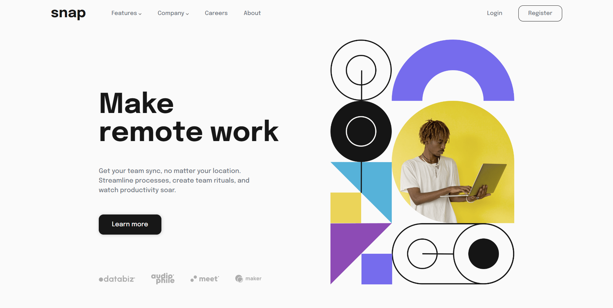

# Frontend Mentor - Intro section with dropdown navigation solution

This is a solution to the [Intro section with dropdown navigation challenge on Frontend Mentor](https://www.frontendmentor.io/challenges/intro-section-with-dropdown-navigation-ryaPetHE5). Frontend Mentor challenges help you improve your coding skills by building realistic projects.

## Table of contents

- [Overview](#overview)
  - [The challenge](#the-challenge)
  - [Screenshot](#screenshot)
  - [Links](#links)
- [My process](#my-process)
  - [Built with](#built-with)
  - [What I learned](#what-i-learned)
  - [Useful resources](#Useful-resources)
- [Author](#author)

## Overview

### The challenge

Users should be able to:

- View the relevant dropdown menus on desktop and mobile when interacting with the navigation links
- View the optimal layout for the content depending on their device's screen size
- See hover states for all interactive elements on the page

### Screenshot

### Links

- Solution URL: [Add solution URL here](https://your-solution-url.com)
- Live Site URL: [Add live site URL here](https://your-live-site-url.com)

## My process

### Built with

- Semantic HTML5 markup
- CSS
- Flexbox
- Desktop-first workflow
- Sass/SCSS
- BEM

### What I learned

I've learn building an accessible navigation using a disclosure pattern. Thanks to fronendmentor community who suggested this pattern, also I make some research about disclosure navigation menu in W3C Web Accessiblity Initiative(WAI) where they give all the details.

### Useful resources

- [disclosure navigation menu](https://www.w3.org/WAI/ARIA/apg/example-index/disclosure/disclosure-navigation.html) - building an accessible navigation menu.

## Author

- Website - [Jovan Lanutan](https://portfolio-tan911.vercel.app/)
- Frontend Mentor - [@tan](https://www.frontendmentor.io/profile/tan911)
